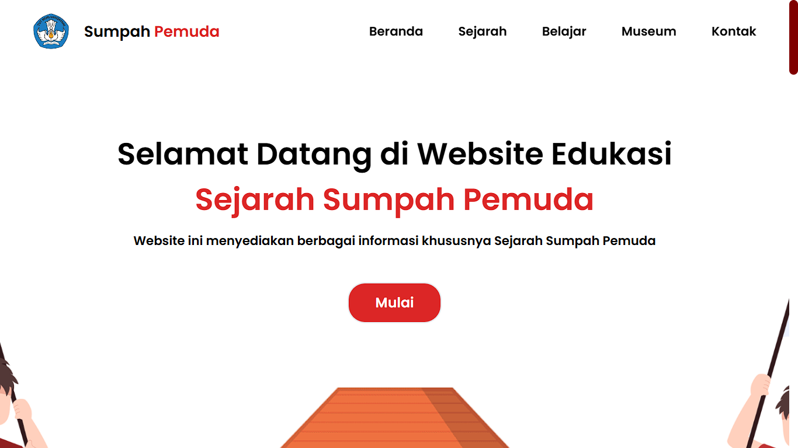

# 🇮🇩 Sumpah Pemuda - Website Sejarah Sumpah Pemuda

---

## 📝 Deskripsi

**Sumpah Pemuda Website** adalah website edukasi yang dibuat untuk memperkenalkan kembali makna dan sejarah **Sumpah Pemuda** kepada generasi muda Indonesia.  
Website ini menyajikan informasi sejarah, isi teks Sumpah Pemuda, tokoh-tokoh pergerakan, hingga makna penting dalam membangun semangat persatuan bangsa.

Dikembangkan menggunakan **React** sebagai library frontend, **Tailwind CSS** untuk styling modern, serta **JavaScript** untuk mendukung interaksi.

---

## 🚀 Teknologi yang Digunakan

| Teknologi  | Deskripsi Singkat |
|------------|-------------------|
|  **React** | Library frontend modern untuk membangun UI interaktif. |
|  **Tailwind CSS** | Utility-first CSS framework untuk styling yang cepat dan responsif. |
|  **JavaScript** | Bahasa pemrograman utama untuk pengembangan frontend. |

---

## ✨ Fitur Utama

### 📜 1. Informasi Sejarah Sumpah Pemuda
Menyajikan informasi sejarah, latar belakang, isi teks Sumpah Pemuda, dan peran penting pemuda dalam sejarah Indonesia.

---

### 👤 2. Profil Tokoh-Tokoh Pergerakan
Informasi tentang tokoh-tokoh penting yang berperan dalam peristiwa Sumpah Pemuda.

---

### 🇮🇩 3. Desain Modern & Edukatif
Tampilan modern, bersih, dan edukatif untuk memudahkan pembaca memahami konten.

---

### 🌐 4. Responsive Design
Website ini **responsif** dan nyaman diakses melalui berbagai perangkat, baik desktop maupun mobile.

---

## 🎯 **Tujuan Project**
- Mengedukasi masyarakat khususnya generasi muda tentang pentingnya Sumpah Pemuda.
- Meningkatkan literasi sejarah bangsa melalui media digital.
- Menyediakan referensi sejarah yang mudah diakses dan dipahami.

---

## 📝 Penutup
Website **Sumpah Pemuda** dibangun dengan teknologi modern, tampilan bersih, dan konten yang bermanfaat sebagai bentuk kontribusi kecil dalam melestarikan semangat persatuan bangsa.

---
